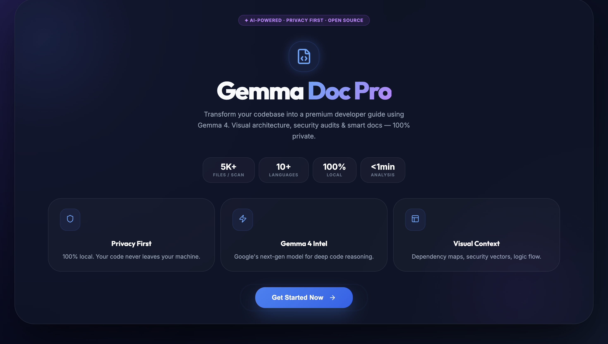
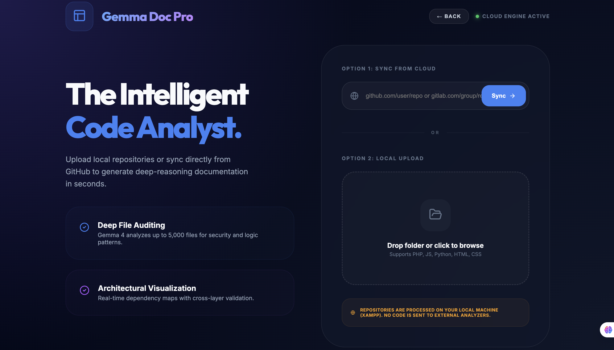
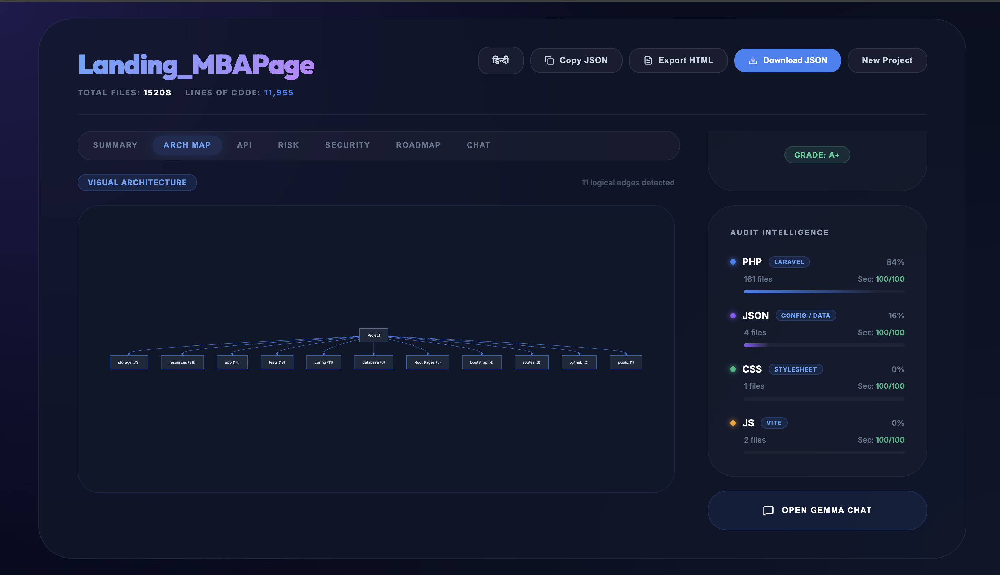
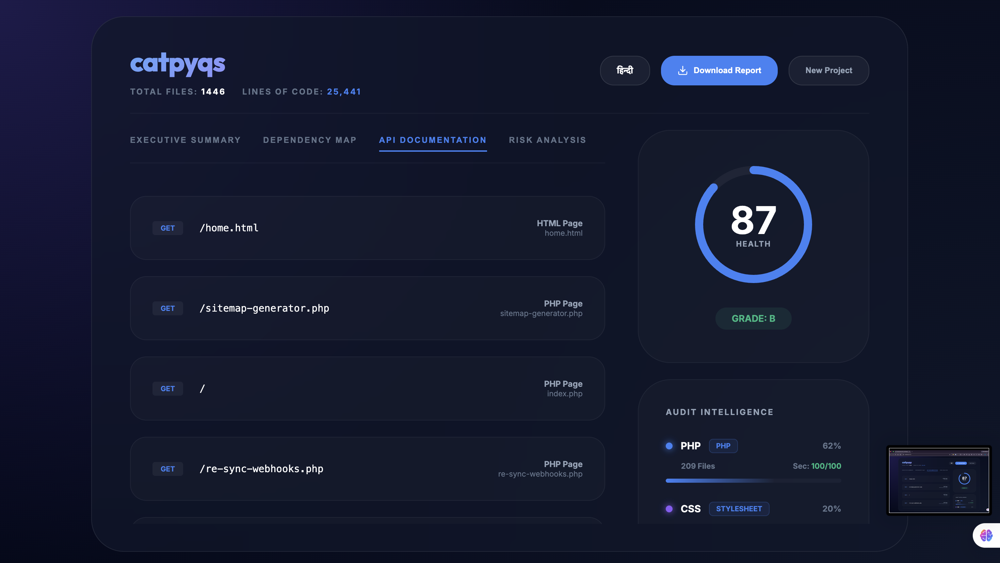
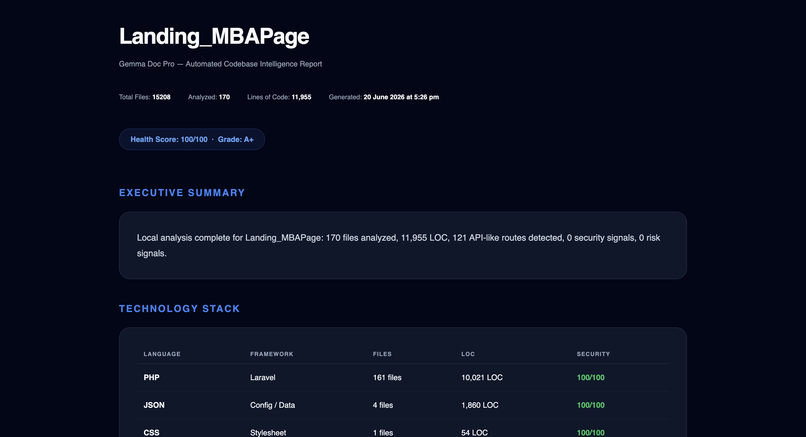
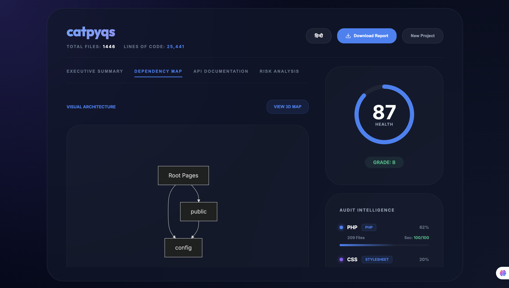
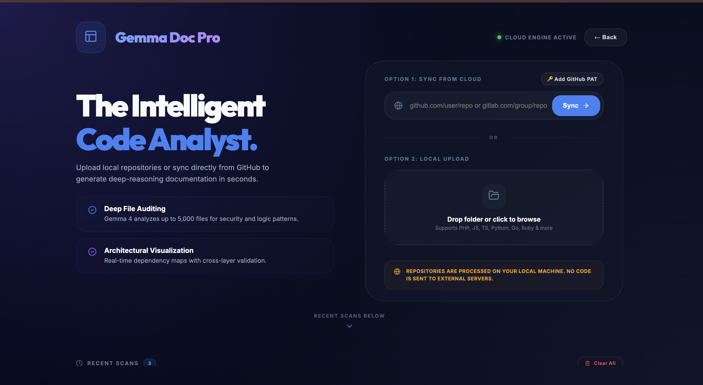

# Gemma Doc Pro — AI-Powered Codebase Intelligence Platform

🚀 **Live Application Demo:** [https://sayista-yazdani.github.io/Gemma-Doc-Pro/](https://sayista-yazdani.github.io/Gemma-Doc-Pro/)

> **Transform any codebase into a production-grade developer guide using Gemma 4 AI. Visual architecture maps, security auditing, API surface detection, and smart documentation — all 100% private and browser-native.**


---

## 📸 Screenshots

### First Dashboard


### Second Dashboard View


### First summary Dashboard


### API Surface Tab


### Security Analysis


### Dependency Graph


### Gemma AI Chat



## Table of Contents

- [Overview](#overview)
- [Key Features](#key-features)
- [Tech Stack](#tech-stack)
- [Project Architecture](#project-architecture)
- [Getting Started](#getting-started)
- [Usage Guide](#usage-guide)
- [Analysis Capabilities](#analysis-capabilities)
- [QA Test Report](#qa-test-report)
- [Bug Fix History](#bug-fix-history)
- [Security](#security)
- [Known Limitations](#known-limitations)
- [Roadmap](#roadmap)

---

## Overview

**Gemma Doc Pro** is a fully browser-based, AI-augmented code intelligence dashboard. It accepts either a **local project folder upload** or a **GitHub/GitLab repository URL**, analyzes the source code entirely on your machine, and produces a multi-tab structured report covering:

- Executive summary with LOC, file count, and API surface
- Visual dependency architecture (clean, dark-themed base Mermaid.js diagram with SVG caching)
- Pinned and interactive Gemma AI chat assistant for contextual codebase Q&A
- Detected API endpoints (Express, Next.js, Laravel, FastAPI, Flask)
- Risk analysis and security vulnerability scanning (OWASP-aligned)
- Optimization roadmap with before/after code refactoring diffs
- Persistent local scan history (localStorage cache) to reload past reports instantly
- Bilingual interface (English / Hindi)

> **No server required.** All analysis runs in the browser. GitHub/GitLab sync uses direct REST APIs in the client — no XAMPP, no PHP, no git binary needed.

---

## Key Features

| Feature | Description |
|---|---|
| 🔒 **Privacy-First** | 100% local analysis. No code leaves your machine. |
| 🗄️ **Persistent Scan Caching** | Local scan history panel displays past reports immediately without re-scanning. |
| 🖥️ **Screen Size Fit & Lock** | Viewport locked to `100dvh` (no overall page scroll), ensuring all components fit beautifully. |
| 🎯 **Interactive Scroll Hint** | Animated bouncing scrollchevron that fades out automatically as you scroll and scrolls to scans on click. |
| 💬 **Pinned Gemma AI Chat** | Chat input and header are pinned at the top/bottom while message list scrolls internally. |
| 🌐 **Git Cloud Direct Sync** | Fetches repositories via GitHub/GitLab REST API — supports PAT for private repos. |
| 🧠 **Multi-Language Detection** | 25+ file types: PHP, JS/TS, Python, Ruby, Go, Rust, Java, HTML, CSS, SQL, TOML and more. |
| 🏷️ **Real Framework Labels** | Detects Next.js, Express, Laravel, Django, Flask, Vue, Angular, NestJS. |
| 🔍 **Security Scanning** | OWASP-aligned: eval(), mysql_query(), hardcoded secrets, XSS risks. |
| 📡 **API Surface Mapping** | Extracts routes from Express, Next.js (Pages + App Router), Laravel, FastAPI, Flask. |
| 🗺️ **Dependency Graph** | Mermaid.js 2D flowchart with custom color tokens and SVG caching. |
| 📊 **Health Score** | Weighted security score (0–100) with letter grade (A+ → D). |
| 🌐 **Bilingual UI** | Toggle between English and Hindi for all tab labels. |
| 📥 **JSON & HTML Export** | Download full audit report as structured JSON or premium HTML page. |

---

## Tech Stack

| Layer | Technology |
|---|---|
| **Frontend Framework** | React 19 + TypeScript (Strict Mode) |
| **Build Tool** | Vite 8 |
| **Animations** | Framer Motion 12 |
| **Icons** | Lucide React |
| **Dependency Graph** | Mermaid.js 11 |
| **Local Analysis Engine** | Custom TypeScript analyzer (`src/lib/analyzer.ts`) |
| **Scan History Cache** | LocalStorage API wrapper (`src/lib/cache/scanHistory.ts`) |
| **Git Integrations** | GitHub & GitLab REST API client (browser-native fetch) |
| **Styling** | Vanilla CSS + custom design token sheets (`src/styles/`) |
| **Typography** | Inter + Outfit (Google Fonts) |

> ⚠️ `api/analyze_repo.php` is present but **no longer used**. Cloud sync now runs entirely in the browser.

---

## Project Architecture

```
Gemma-Doc-Pro/
├── public/
├── src/
│   ├── assets/
│   ├── components/
│   │   ├── RecentScansPanel.tsx    # Persistent scan history list
│   │   └── UIComponents.tsx        # FeatureCard, StatBadge and UI primitives
│   ├── lib/
│   │   ├── cache/
│   │   │   └── scanHistory.ts      # scan history local storage helper
│   │   ├── cloud/
│   │   │   ├── github.ts           # GitHub REST API sync provider
│   │   │   ├── gitlab.ts           # GitLab REST API sync provider
│   │   │   ├── types.ts            # Git cloud types
│   │   │   └── index.ts            # Cloud client provider entry
│   │   ├── export/
│   │   │   └── htmlExport.ts       # Self-contained HTML report exporter
│   │   └── analyzer.ts             # Core analysis engine
│   ├── styles/
│   │   ├── animations.css          # Core keyframes (spin, bounce-y, glow)
│   │   └── utilities.css           # Utility classes (glass cards, badge pills)
│   ├── views/
│   │   ├── LandingView.tsx         # Splash/Hero screen
│   │   ├── DashboardView.tsx       # Input panel (sync + local upload + scroll hint)
│   │   └── DocView.tsx             # Tabbed report viewer (fixed tabs, pinned chat)
│   ├── App.tsx                     # Main router + global viewport wrappers
│   ├── index.css                   # Global reset, typography, and base layout styles
│   └── main.tsx                    # React root mount
├── package.json
├── tsconfig.json
└── vite.config.ts
```

---

## Getting Started

### Prerequisites

- Node.js ≥ 18
- npm ≥ 9

### Installation

```bash
cd Gemma-Doc-Pro
npm install
npm run dev
```

App opens at: **http://localhost:5174** (or port configured by Vite)

### Build for Production

```bash
npm run build
# Output in /dist — deployable to Vercel, Netlify, Github Pages or XAMPP
```

---

## Usage Guide

### Option 1: Git Repository Sync

1. Click **Get Started Now** on the landing page.
2. In the "Sync from Cloud" input, paste any public GitHub/GitLab URL.
3. Click **Sync →**
4. Optional: Click **Add GitHub PAT** to authenticate for higher rate limits or private repos.

### Option 2: Local Project Upload

1. Click the **"Drop folder or click to browse"** dropzone.
2. Select your project's root folder.
3. Watch real-time progress as files are audited locally in milliseconds.

---

## Bug Fix History

### Session 2 Fixes (Latest Layout & Render Fixes)

| Bug | Severity | Status | Fix |
|---|---|---|---|
| **Render Crash** Blank screen upon document view load | 🔴 Critical | ✅ Fixed | Restored missing `Network` icon import in `DocView.tsx` |
| **Overflow / Cutoff** Layout stretched and cut off components | 🔴 High | ✅ Fixed | Locked body, root, and App wrappers to `100dvh` with `overflow: hidden` |
| **Gemma Chat Scroll** Pushed input off-screen on messages scroll | 🔴 High | ✅ Fixed | Pinned chat header and text field, scrolling messages internally |
| **Hidden Tab Bar** Tab buttons scrolled off-screen when browsing | 🟡 Low | ✅ Fixed | Changed Left Column layout to keep tabs fixed and scroll panels internally |
| **Scroll Awareness** Users unaware of Recent Scans below | 🟡 Low | ✅ Fixed | Added bouncing Chevron hint that fades out on scroll & auto-scrolls on click |

### Session 1 Fixes (Core Analysis Fixes)

| Bug | Severity | Status | Fix |
|---|---|---|---|
| **BUG-001** "Try Again" permanently stuck on error screen | 🔴 High | ✅ Fixed | Added `onRetry` prop; calls parent `setAnalysisError(null)` |
| **BUG-002** GitHub Sync non-functional (XAMPP write error) | 🔴 Critical | ✅ Fixed | Replaced PHP backend with direct GitHub REST API in `App.tsx` |
| **BUG-003** Chat send button labeled "Gemma Chat" | 🟡 Low | ✅ Fixed | Changed to `"Send ↑"` |
| **BUG-004** Dashboard header overflow on small screens | 🟡 Low | ✅ Fixed | `marginBottom: clamp(1.5rem, 4vh, 5rem)` |
| **BUG-005** Mermaid SVG re-renders on every tab switch | 🟡 Low | ✅ Fixed | Added `useRef<Map<string, string>>` SVG cache |
| **VANILLA Bug** All languages showing "Vanilla" framework | 🔴 High | ✅ Fixed | Rewrote `frameworkForLang()` with semantic labels per language |

---

## License

This project is developed for academic/competition purposes.  
© 2026 Sayista Yazdani — All rights reserved.
